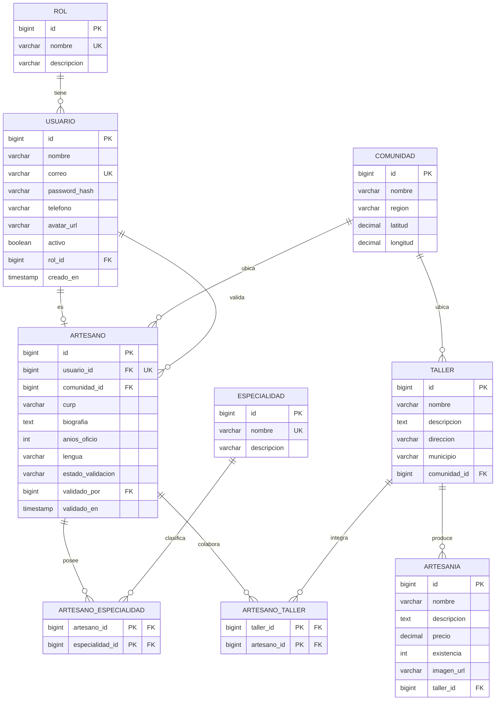

# Manos de Oaxaca

## Sistema de gestión de artesanos, talleres y artesanías

Plataforma web de back-office para el **Instituto Oaxaqueño de las Artesanías (ARIPO)**.

## Integrantes:

- Dalia Montserrat Caballero Silva — [MontseCaballero29](https://github.com/MontseCaballero29)
- Melissa Gandarillas — [MeliGandarillas](https://github.com/MeliGandarillas)

Proyecto final — Programación Web · Instituto Tecnológico de Oaxaca (ITO)

---

## Descripción del proyecto

**Manos de Oaxaca** es un sistema web diseñado para registrar, organizar, administrar y consultar información relacionada con los artesanos, talleres y artesanías del estado de Oaxaca.

El sistema concentra en un solo lugar la información de los artesanos, sus especialidades, los talleres en los que colaboran y las artesanías que elaboran.

## Problemática que resuelve

En Oaxaca existe una gran diversidad de artesanos y talleres dedicados a la elaboración de productos tradicionales. Sin embargo, la información sobre ellos suele encontrarse dispersa, incompleta o desactualizada. Esto dificulta conocer quiénes son los artesanos, qué especialidades tienen, en qué talleres trabajan, dónde se encuentran esos talleres y qué artesanías producen.

Manos de Oaxaca resuelve esta problemática mediante una plataforma que administra y consulta esta información de forma organizada, accesible y centralizada.

---

## Tecnologías utilizadas

**Backend**
- Java + Spring Boot 4
- Spring Security + JWT (autenticación sin estado)
- Contraseñas cifradas con BCrypt
- Spring Data JPA / Hibernate
- MySQL 8
- Flyway (migraciones versionadas)
- Bean Validation

**Frontend**
- React + Vite
- React Router DOM (ruteo y rutas protegidas)
- Fetch API (con token JWT en el header)

**Otros**
- Bruno (pruebas de la API)
- Figma (diseño de interfaz)

---

## Diagrama Entidad-Relación



### Relaciones principales

- Un **rol** puede estar asignado a varios **usuarios**.
- Un **usuario** puede tener un perfil de **artesano** (relación 1:1).
- Una **comunidad** ubica a varios **artesanos** y varios **talleres**.
- Un **artesano** puede dominar varias **especialidades**, y una especialidad la comparten varios artesanos (**relación muchos a muchos** vía `artesano_especialidad`).
- Un **artesano** puede colaborar en varios **talleres**, y un taller integra varios artesanos (**relación muchos a muchos** vía `artesano_taller`).
- Un **taller** puede producir varias **artesanías**.
- Un **usuario** administrador puede validar a varios **artesanos** (campo `validado_por`).

---

## API REST

URL base local: `http://localhost:8090`

Todas las rutas fuera de `/api/auth/**` requieren el encabezado `Authorization: Bearer <token>`.

### Autenticación — `/api/auth` (público)

| Método | Ruta | Descripción |
|--------|------|-------------|
| POST | `/api/auth/register` | Registra un visitante. Devuelve token JWT, correo y rol. |
| POST | `/api/auth/login` | Valida credenciales (BCrypt). Devuelve token JWT, correo y rol. |

### Artesanos — `/api/artesanos`

| Método | Ruta | Rol | Descripción |
|--------|------|-----|-------------|
| GET | `/api/artesanos` | Autenticado | Listado con paginación y filtros (`comunidadId`, `estadoValidacion`, `page`, `size`). |
| GET | `/api/artesanos/{id}` | Autenticado | Obtiene un artesano por id. |
| POST | `/api/artesanos` | ADMIN | Crea un artesano. |
| PUT | `/api/artesanos/{id}` | ADMIN | Actualiza un artesano. |
| DELETE | `/api/artesanos/{id}` | ADMIN | Elimina un artesano. |

### Talleres — `/api/talleres`

| Método | Ruta | Descripción |
|--------|------|-------------|
| GET | `/api/talleres` | Lista todos los talleres. |
| GET | `/api/talleres/{id}` | Obtiene un taller por id. |
| POST | `/api/talleres` | Crea un taller. |
| PUT | `/api/talleres/{id}` | Actualiza un taller. |
| DELETE | `/api/talleres/{id}` | Elimina un taller. |

### Artesanías — `/api/artesanias`

| Método | Ruta | Rol | Descripción |
|--------|------|-----|-------------|
| GET | `/api/artesanias` | Autenticado | Lista todas las artesanías. |
| GET | `/api/artesanias/{id}` | Autenticado | Obtiene una artesanía por id. |
| POST | `/api/artesanias` | ADMIN | Crea una artesanía. |
| PUT | `/api/artesanias/{id}` | ADMIN | Actualiza una artesanía. |
| DELETE | `/api/artesanias/{id}` | ADMIN | Elimina una artesanía. |

---

## Roles de usuario

### Administrador
Acceso total: gestión de usuarios, roles, artesanos, talleres, especialidades y artesanías.

### Artesano
Consulta y actualiza su perfil, y administra sus talleres y artesanías. Los artesanos pasan por un proceso de validación por parte de ARIPO antes de ser aprobados.

### Visitante
Consulta artesanos, talleres y artesanías, y utiliza búsquedas y filtros. No puede modificar información. Es el rol que se asigna al registrarse de forma pública.

---

## Credenciales de prueba

Usuarios ya cargados en los datos de prueba, uno por cada rol:

| Rol | Correo | Contraseña |
|-----|--------|------------|
| Administrador | `admin@aripo.gob.mx` | `Admin123!` |
| Artesano | `artesano@aripo.gob.mx` | `Artesano123!` |
| Visitante | `cliente@gmail.com` | `Cliente123!` |

El usuario administrador permite ingresar y evaluar todos los módulos del sistema.

---

## Instrucciones de instalación

### Requisitos previos
- Java 21 o superior y Maven
- MySQL 8 en ejecución, con la base `manos_oaxaca_final` creada
- Node.js y npm

### Configuración

Copia `application.properties.example` a `application.properties` dentro de `backend/src/main/resources/` y completa los valores (credenciales de MySQL, clave secreta del JWT). Este archivo no se sube al repositorio por seguridad.

### Backend

```bash
cd backend
./mvnw spring-boot:run
```

En Windows (PowerShell): `.\mvnw.cmd spring-boot:run`

El servidor arranca en `http://localhost:8090`. Flyway aplica las migraciones automáticamente.

### Frontend

```bash
cd frontend
npm install
npm run dev
```

La aplicación queda disponible en `http://localhost:5173`.

---

## Base de datos

- Motor: **MySQL 8**.
- Las tablas se crean y versionan mediante **migraciones de Flyway** (`backend/src/main/resources/db/migration/`), no manualmente ni por generación automática de JPA (`ddl-auto=validate`).
- Datos de prueba cargados mediante migraciones de seed.
- Relación muchos a muchos entre `artesano` y `especialidad` (y también entre `artesano` y `taller`).

---

## Seguridad

- Contraseñas almacenadas con **BCrypt**.
- Autenticación **JWT**; sesión sin estado.
- Autorización por rol con `@PreAuthorize`.
- Manejo global de errores con `@RestControllerAdvice` (respuestas JSON con códigos HTTP 400, 401, 403, 404, 500).
- Validaciones con Bean Validation en el backend y validaciones visibles bajo cada campo en el frontend.
- Variables sensibles fuera del repositorio; se incluye `application.properties.example`.

---

## Pruebas de la API

Las pruebas de los endpoints están documentadas en una colección de **Bruno**, versionada dentro del repositorio. Incluye login y obtención del token JWT, uso del token en peticiones protegidas, y casos de error (acceso denegado y recurso no encontrado).

---

## Organización del proyecto

El desarrollo se administra mediante GitHub Projects con las columnas: Backlog, To Do, In Progress, In Review y Done.

### Repositorio de GitHub
https://github.com/MontseCaballero29/Proyecto_Final_PrograWeb

### GitHub Projects
https://github.com/users/MontseCaballero29/projects/1

### Prototipo de Figma
*https://www.figma.com/proto/CbaXPifFINz2uZvt2uEyDT/Proyecto_Final_Equipo2?node-id=2019-13&t=b3MalXEKAQhqGxqS-1*

### Proyecto desplegado (VPS)
*(URL)*

---

## Estado actual

Desarrollo en curso. Backend con autenticación, roles y CRUD de artesanos, talleres y artesanías funcionando; frontend con inicio de sesión, registro, manejo de sesión y rutas protegidas. Pendientes: gestión de artesanos en el frontend, comunicación (correo, SMS, WhatsApp) y despliegue en el VPS.